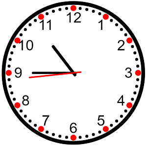
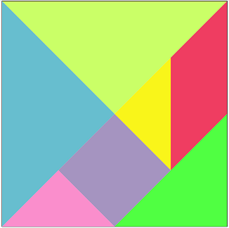
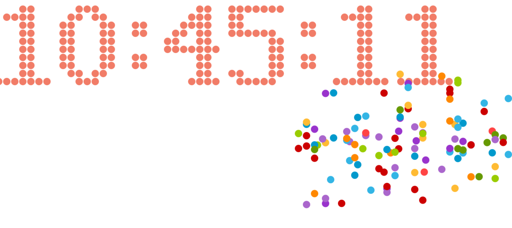
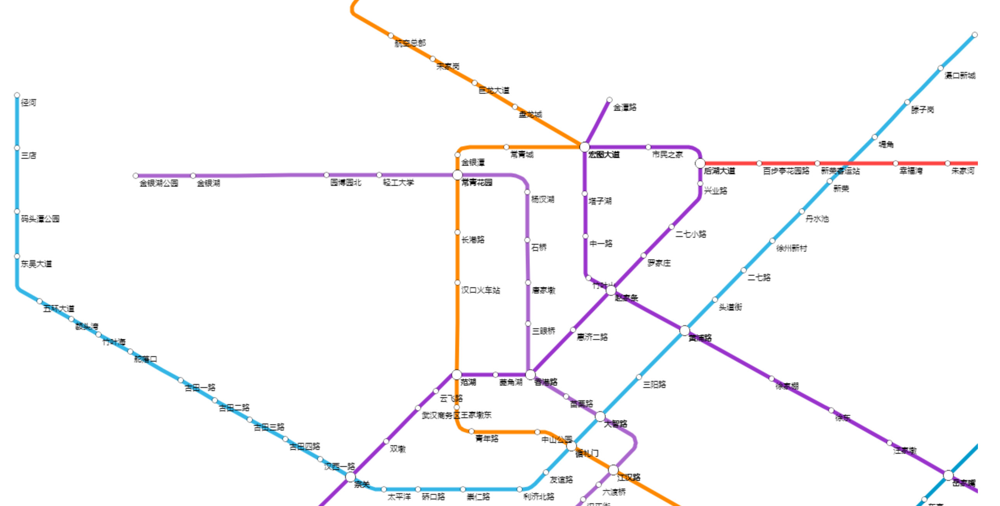

# canvasdemo
### canvas时钟  

### 七巧板  

### 五角星

### 任意边的多边形封装
参数:绘图上下文、x、y、半径、几边形、起始角度、strokeStyle、fillStyle
```javascript
var p1=new Polygon(ctx,50,50,50,5,0,"green");
p1.strokePolygon();
var p2=new Polygon(ctx,150,150,50,4,45,"blue","red");
p2.strokePolygon();
p2.fillPolygon();
```
### 计时

### 地铁  
